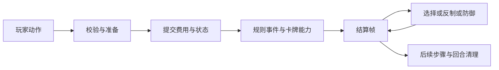

# 卡牌引擎的边界与扩展

运行规则以显式 Go 行为为准。卡牌文字、JSON 快照与前端展示不参与效果推断。以下结构是添加卡牌和检查改动影响的入口。

## 动作、结算与事件

`engine.go` 持有对局状态、锁、随机源和诊断记录，并分派玩家动作。召唤、施法、支付、防御、死亡、回合和状态视图分别在独立模块中。



准备阶段只检查并计算，失败不能消耗资源、吞噬目标或改变区域。`summonPlan` 和 `actionCostPlan` 展示这一边界。卡牌可通过 `AbilityValidationBehavior`、`ItemUseValidationBehavior`、`SpellPreparationBehavior`、`PaymentConstraintBehavior` 等接口声明特殊规则。提交后的步骤不得再返回可以预先发现的输入错误。

需要等待交互的顺序效果使用 `runResolution`。选择和法术持有等待它们的结算帧；重试不推进，成功或失效跳过才恢复。详见 [结算协议](engine-resolution.md)。同批群体伤害与死亡触发仍保持批处理，不把每个目标强行拆成独立等待步骤。

付费、免费和虚拟施法共用 `dispatchPreparedSpell` 的反制、防御、命中和恢复逻辑。各入口仍分别验证自身的合法性、费用和实体卡使用条件；复制法术不伪装成实体卡支付。

## 来源、观察者与伤害

`EffectContext.Source` 是观察或执行效果的卡牌。它不一定是事件来源，也不一定是受影响对象。

- `DamageRequest` 是生产代码的伤害入口。目标决定受伤方；`Source` 或明确的 `SourceKnown/SourcePlayer` 决定归属。零值来源表示未知。
- `DamageEvent` 明确目标、伤害来源、数值、元素、法术和状态伤害。观察者声明 `DamageScope`，不从目标身上的点燃标记猜测伤害类型。
- `SpellEvent` 提供施法者、法术对象、用途、威力、命中对象等规则投影；`CounterEvent` 表达可响应的窗口。
- `CardSearchedEvent`、`OverexertPaymentEvent` 和 `CardStateChange` 分别表示检索、透支支付和持续规则所依赖的状态变化。

伤害放大先形成实际待处理数值，减伤查询生成计划，提交时才消费一次性减伤。放弃致命防止继续原提交步骤，不重新执行计算。命中后的伤害统计和效果等待整批伤害交互结束。隐藏区域受伤触发可以排队；相同候选组每个事件只生成一个选择。

原有 `EffectRegistry` 是懒加载适配层。部分通用触发仍使用 `ExtraData` 封装既有事件数据，类型化投影集中在引擎边界，网络事件也保持现有 map/JSON 协议。这不等于可持久化事件溯源：结算帧保留 Go 闭包，不能保存到数据库后恢复。

## 持续修正与合理的条件判断

查询应当纯粹：计算费用、威力、伤害或前端候选时，不能消耗能力。消耗在实际操作提交时发生。`modifier_lifecycle.go` 统一临时修正的回合边界和使用次数；具体 `ModifierKind` 仍表达不同规则用途。

`SlotGrant`、`HandLimitGrant`、`SpellPowerScale` 和 `SpellTargetGrant` 用明确的数据表达组合。非空 `Group` 表示同组不叠加；不同组按稳定场上顺序组合。没有自动推断的“同卡不叠加”。石化、离场和能力失效必须撤销相应规则。

卡牌自己的 `if` 是正常的：例如“仅当目标为水属性”“如果本回合尚未触发”。通用调度不应写“卡号 A 做这个、卡号 B 做那个”。新机制先判断能否复用已有边界，确实有新时机或新规则职责时再增加小接口，不为每张卡造一个引擎接口。

运行时授予的能力挂在实例的附加行为上。不要用字符串状态假装新增了遗言或主动能力。行为接口必须配合实例的 `HasActive...` 判断。

## 新卡与影响检查

1. 在 `card_<number>_<name>.go` 实现行为、校验和规则声明；仅该卡使用的 helper 同文件维护。
2. 注册懒工厂。不要把卡号加入伤害、反制、费用或目标的中央名单。
3. 添加卡牌正常路径、非法输入不消费状态以及与相关机制组合的回归用例。
4. 从 `server/` 执行影响查询，再检查相关共享规则和组合测试：

```sh
go run ./cmd/card-impact --card 1111003
go run ./cmd/card-impact --file damage.go
```

报告包含源码位置、传递 helper 依赖、共用能力/类型事件与测试引用。它是保守的静态分析：同名方法可能扩大结果，动态回调、注册和共享状态可能产生无法静态证明的关系。它不能保证未列出的卡不受影响，也不自动替代全量测试。

随机复现使用 `NewEngineWithSeed`。同一版本、初始配置、游戏 ID、种子和动作顺序应产生相同结果；每局随机源和对象序号独立。`ReplaySeed` 与有界 `DebugResolutionTrace` 仅用于内部诊断，不进入玩家或观众视图。追踪记录动作、父子结算帧、等待窗口与发出的事件类型，不是完整持久化快照。

验证要求见 [AGENTS.md](../AGENTS.md)：全量 Go 测试、vet、适用的 race 检查；改动交互或回合协议时必须双客户端验证。API 房间并发与 WebSocket 慢客户端风险是传输层已有约束，不能用引擎单元测试通过来证明已解决。
